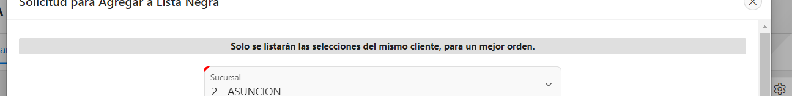

# Esto es para dejar de forma gris y utilizar el item como un titulo
- 
- Va en: Advanced/Custom Attributes: 
- ```style="border-style:double; background: #dfdfdf; padding:0rem; min-height:0rem;"```