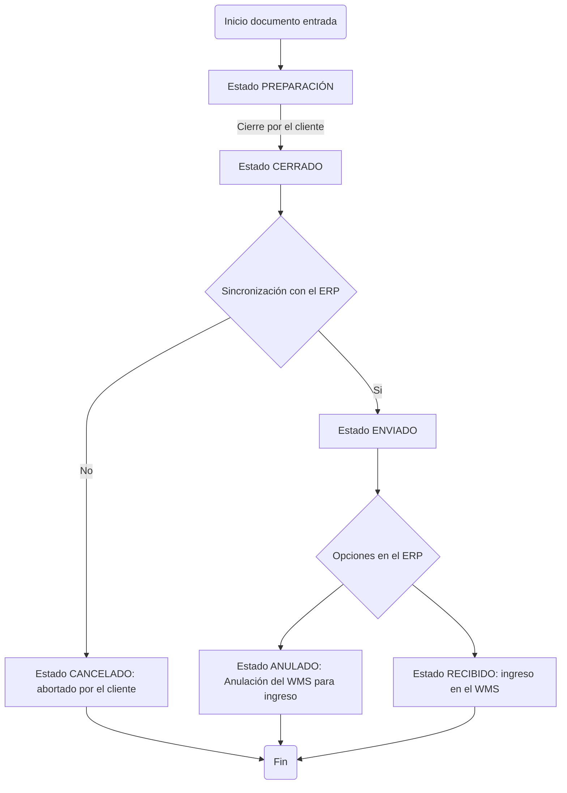

```mermaid
flowchart TD
    INICIO(Inicio documento entrada)-->PREPARACION
    PREPARACION[Estado PREPARACIÓN] -->|Cierre por el cliente|CERRADA[Estado CERRADO]
    CERRADA --> OPCIONES{Sincronización con el ERP}
    OPCIONES -->|No| CANCELADA[Estado CANCELADO: abortado por el cliente]
    CANCELADA -->FIN(Fin)
    OPCIONES -->|Si|ENVIADA[Estado ENVIADO]
    ENVIADA -->OPCION_ERP{Opciones en el ERP}
    OPCION_ERP --> ANULADA[Estado ANULADO: Anulación del WMS para ingreso]
    OPCION_ERP --> RECIBIDA[Estado RECIBIDO: ingreso en el WMS]
    ANULADA -->FIN(Fin)
    RECIBIDA -->FIN(Fin)
```