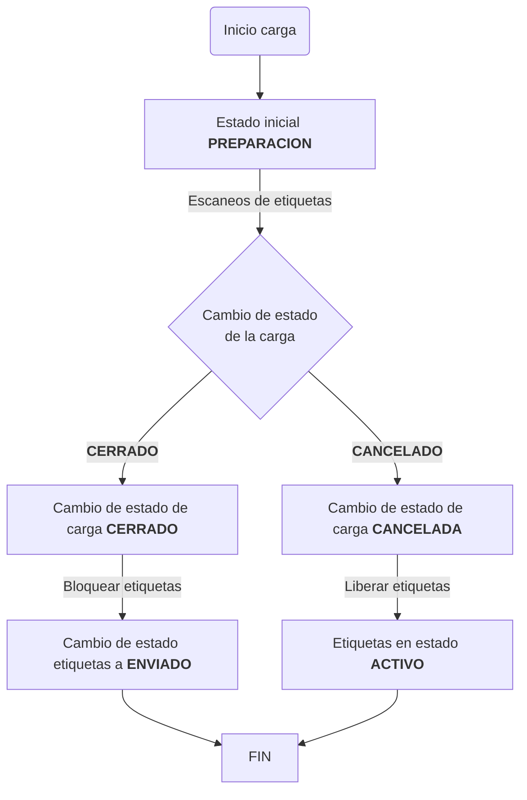

```mermaid
flowchart TD
    INICIO(Inicio carga)-->PREPARACION
    PREPARACION[Estado inicial <b>PREPARACION</b>]-->|Escaneos de etiquetas|OPCIONES{Cambio de estado<br> de la carga}
    OPCIONES-->|<b>CERRADO</b>| CERRADO[Cambio de estado de carga <b>CERRADO</b>]
    CERRADO-->|Bloquear etiquetas|BLOQUEO_ETIQ[Cambio de estado etiquetas a <b>ENVIADO</b>]
    OPCIONES-->|<b>CANCELADO</b>| CANCELADO[Cambio de estado de carga <b>CANCELADA</b>]
    CANCELADO-->|Liberar etiquetas|LIBERARA_ETIQ[Etiquetas en estado <b>ACTIVO</b>]
    BLOQUEO_ETIQ-->FIN
    LIBERARA_ETIQ-->FIN
```